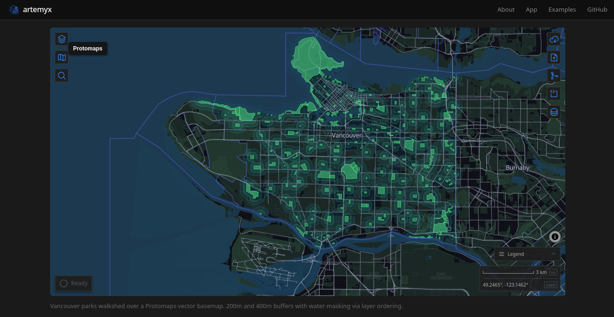

# artemyx



A declarative GIS application using MapLibre GL JS with client-side data processing via DuckDB-WASM.

**Live:** [artemyx.org](https://artemyx.org)

## Overview

- **Mapping:** MapLibre GL JS with WebGL-based rendering for smooth panning/zooming
- **Data Storage:** DuckDB-WASM with spatial extension for in-browser SQL queries
- **Data Loading:** Fetch GeoJSON, CSV, GeoParquet, JSON arrays, and PMTiles from public API endpoints or local files, with paginated fetching and CRS auto-detection

## Key Features

- Interactive mapping with switchable basemaps (CARTO, Satellite)
- Multi-dataset support with layer management UI (visibility, color, rename, delete, per-layer style panel with labels)
- Auto-generated legend from active layer styles (color swatches, gradient ramps, category entries)
- YAML-driven configuration with in-browser editor (live syntax highlighting, edit/run/clear/import/generate/export)
- Visual operation builder UI for constructing spatial operations without editing YAML directly
- Spatial operations via DuckDB-WASM (buffer, intersection, union, difference, contains, distance, centroid, attribute filter)
- Multi-format loading (GeoJSON, CSV, GeoParquet, JSON arrays, PMTiles) with paginated fetching
- PMTiles vector tile support with multi-layer archives, per-layer panel entries, and automatic style detection
- Local file upload via drag-and-drop or file picker
- CRS detection and automatic reprojection to WGS84
- OPFS persistence - sessions survive page refresh, with viewport restore and database export/import for portable sessions
- Multi-geometry rendering (Point, LineString, Polygon, Multi* variants)
- Address search via Photon geocoding (OSM data, no API key)
- Scale bar (metric/imperial) and mouse coordinate display (decimal degrees / DMS toggle)
- Feature inspection with property popups and hover tooltips
- Config-driven outputs with format selection (GeoJSON, CSV, Parquet, PMTiles) and zip download
- PMTiles extraction from remote vector tile archives with tile decoding and feature deduplication
- Fully client-side - no backend required

## Tech Stack

- **Astro** - Static site generator
- **MapLibre GL JS** - Open-source WebGL mapping library
- **DuckDB-WASM** - In-browser analytical SQL database with spatial extension
- **TypeScript** - Type-safe development

## Architecture

```
src/scripts/
├── config/            # YAML parsing, validation, operations graph
│   ├── parser.ts      # Config loading and validation
│   ├── types.ts       # MapConfig, DatasetConfig, OperationConfig
│   ├── validators/    # Domain-specific validation (datasets, operations, layers, shared)
│   ├── operations-graph.ts  # Dependency resolution, topological sort
│   ├── executor.ts    # Spatial operation execution
│   ├── generator.ts   # Generate YAML config from current session state
│   ├── export-config.ts    # Export config as YAML file download
│   ├── export-viewer.ts    # Export viewer-ready ZIP (config + data files)
│   ├── output-executor.ts  # Config-driven output execution (GeoJSON, CSV, Parquet, PMTiles)
│   ├── output-types.ts     # Output format types and PMTiles params
│   └── operations/    # One file per operation (buffer, intersection, union, ...) + shared render.ts
├── db/                # DuckDB-WASM (runs in Web Worker)
│   ├── worker.ts      # Module worker entry point, message dispatch, full load pipeline
│   ├── worker-types.ts # Typed discriminated union message protocol
│   ├── client.ts      # Main-thread RPC client (async API matching old direct modules)
│   ├── core.ts        # DB init, OPFS persistence, spatial extension (worker-side)
│   ├── datasets.ts    # Dataset CRUD operations (worker-side)
│   ├── features.ts    # Feature queries, GeoJSON export (worker-side)
│   ├── constants.ts   # Pure constants, types, localStorage helpers (shared)
│   ├── pmtiles-reader.ts  # PMTiles tile fetching, MVT decoding, feature deduplication
│   ├── pmtiles-writer.ts  # PMTiles archive generation (geojson-vt + vt-pbf)
│   └── utils.ts       # Hash generation, helpers
├── loaders/           # Format loader registry
│   ├── index.ts       # Barrel re-export
│   ├── types.ts       # Format types (ConfigFormat, DetectedFormat)
│   ├── detect.ts      # Format detection (URL extension, path segment, Content-Type)
│   ├── geojson.ts     # GeoJSON normalizer
│   ├── csv.ts         # CSV parser, delimiter and coordinate auto-detection
│   ├── geoparquet.ts  # GeoParquet via DuckDB registerFileBuffer
│   ├── json-array.ts  # JSON array loader with geo column fallback
│   ├── pmtiles.ts     # PMTiles header reader and vector layer metadata extraction
│   ├── columns.ts     # Shared lat/lng column detection heuristics
│   ├── crs.ts         # CRS parsing and detection utilities
│   └── paginator.ts   # Paginated GeoJSON fetching (ArcGIS, Socrata, OGC)
├── data-actions/      # Data loading pipeline
│   ├── load.ts        # Barrel re-export
│   ├── shared.ts      # Types, validation, quota check, map helpers
│   ├── load-url.ts    # URL fetch pipeline with pagination
│   ├── load-file.ts   # Local file loading
│   ├── load-config.ts # YAML config batch loading
│   └── load-pmtiles.ts # PMTiles vector tile loading (header, layers, sources)
├── logger/            # Logging abstraction
│   ├── types.ts       # Logger interface (progress, info, warn)
│   └── browser.ts     # BrowserLogger wrapping ProgressControl
├── layers/            # MapLibre layer creation
│   ├── index.ts       # Barrel re-export
│   ├── layers.ts      # addLayerFromConfig, executeLayersFromConfig
│   └── sources.ts     # Source management (GeoJSON and vector tile sources)
├── layer-actions/     # Layer control UI handlers
│   ├── color.ts, style.ts, labels.ts, visibility.ts, delete.ts, export.ts  # Action handlers
│   ├── context-menu.ts, context-menu-items.ts         # Context menu
│   ├── layer-row.ts   # Row DOM, inline rename
│   └── rename.ts      # Dataset ID cascading rename
├── controls/          # MapLibre custom map controls
│   ├── data-control.ts       # Load data from URL with advanced options (CRS, format, columns)
│   ├── upload-control.ts     # Local file upload (drag-and-drop, file picker)
│   ├── config-control.ts     # Config editor (edit, run, clear, import, generate, export) with live Shiki highlighting
│   ├── operation-builder-control.ts  # Visual operation builder with live YAML preview
│   ├── layer-control.ts      # Layer visibility, color, rename, delete, reorder
│   ├── legend-control.ts     # Auto-generated legend from active layer styles
│   ├── storage-control.ts    # OPFS status, session management, database export/import
│   ├── geocoding-control.ts  # Address search via Photon geocoding
│   ├── basemap-control.ts    # Basemap switcher
│   ├── scale-control.ts      # Scale bar, coordinate display (DD/DMS)
│   ├── progress-control.ts   # Status log with expandable history
│   └── popup.ts              # Feature popup and hover tooltip utilities
├── ui/                # Reusable UI components
│   ├── error-dialog.ts
│   ├── advanced-options.ts  # DataControl advanced options panel
│   └── safari-banner.ts    # Dismissible Safari compatibility warning
├── utils/             # Shared utilities
│   ├── highlight-config.ts  # Shiki YAML highlighting helper
│   ├── shiki.ts             # Shiki instance and theme management
│   └── safari-detect.ts     # Safari/WebKit detection
├── examples/          # Example registry and routing
├── icons/             # Phosphor SVG icon strings
├── db.ts              # DuckDB singleton reference (main thread)
├── teardown.ts        # Clean teardown (remove all datasets, sources, layers)
├── map.ts             # MapLibre init + config loading (entry point)
└── basemaps.ts        # Basemap tile configurations
```

Data flows through: **YAML config** -> **Web Worker** (DuckDB-WASM storage + spatial ops) -> **Main thread** (MapLibre rendering + UI)

## Development

```sh
npm install
npm run dev
```

Visit `localhost:4321` to view the application.

## Build

```sh
npm run build
```

Production site outputs to `./dist/`.

## Testing

```sh
npm test            # Run tests once
npm run test:watch  # Watch mode (re-runs on file changes)
```

Tests use Vitest and are co-located with source files (`*.test.ts`). Covers operations graph, format detection, CRS parsing, CSV parsing, GeoJSON normalization, unit conversion, column detection, and dataset ID utilities.

## Configuration

Create a YAML config file in `public/` (e.g., `my-config.yaml`) and reference it via `data-config` on the `#map` element:

```yaml
map:
  center: [-123.1207, 49.2827]  # [longitude, latitude]
  zoom: 12                       # 0-22
  basemap: carto-dark            # carto-dark | carto-light | carto-voyager | esri-satellite

datasets:
  - id: bikeways                 # Unique identifier
    url: "https://..."           # GeoJSON URL (HTTPS required)
    name: Vancouver Bikeways     # Display name (optional)
    color: "#22c55e"             # Hex color (optional)
    style:                       # Style overrides (optional)
      lineWidth: 3
      fillOpacity: 0.3
      pointRadius: 6

  - id: basemap                  # PMTiles vector tile source
    url: "https://example.com/tiles.pmtiles"
    format: pmtiles

operations:
  - type: buffer
    input: bikeways
    output: bikeway_buffer
    params:
      distance: 200
      units: meters
      dissolve: true

# Explicit layer definitions (optional - auto-generated if omitted)
# Layers render in order: first = bottom, last = top
layers:
  - id: buffer-fill
    source: bikeway_buffer
    type: fill
    paint:
      fill-color: "#f59e0b"
      fill-opacity: 0.15

  - id: bikeways-line
    source: bikeways
    type: line
    paint:
      # MapLibre expressions for data-driven styling
      line-color:
        - interpolate
        - ["linear"]
        - ["get", "speed_limit"]   # Property name (case-sensitive)
        - 30
        - "#22c55e"                # Green at 30
        - 50
        - "#ef4444"                # Red at 50
      line-width: 2.5
```

Layers support full MapLibre paint/layout properties including expressions (`match` for categories, `interpolate` for gradients).

## Browser Compatibility

Requires Chrome, Firefox, or Edge. Safari's per-tab memory limits are too low for DuckDB-WASM with spatial operations - Safari users see a warning banner and get basemap/geocoding/scale bar only. A lightweight viewer (no DuckDB) is on the roadmap for full cross-browser support.

## Status

[changelog](CHANGELOG.md) - [roadmap](ROADMAP.md)
